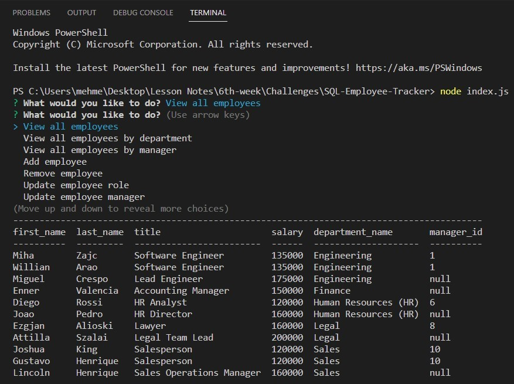
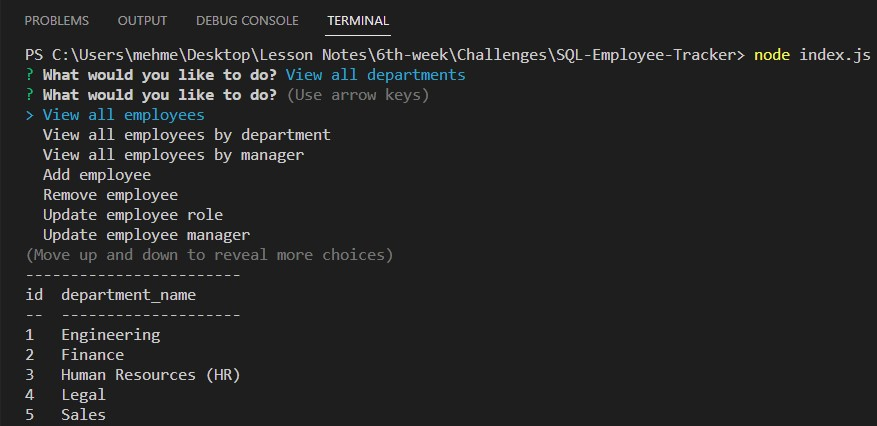
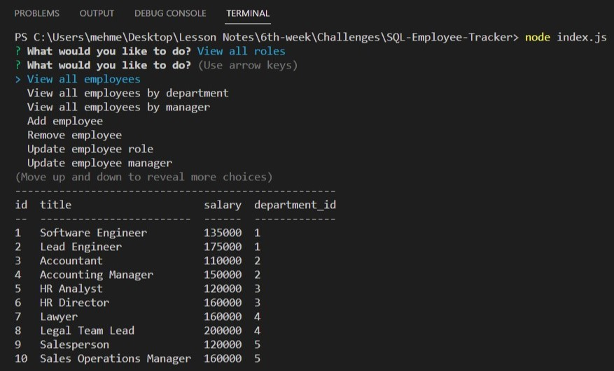

# SQL-Employee-Tracker

## Table of Contents
* [Description](#description)
* [Usage Demonstration Link](#usage-demonstration-link)
* [User Story](#user-story)
* [Screenshots](#screenshots)
* [Code Snippet](#code-snippet)
* [Technologies Used](#technologies-used)
* [Credits](#credits)
* [Author Links](#author-links)
* [License](#license)


## Description

This application is command-line application to manage a company's employee database, using Node.js, Inquirer, and MySQL. This system has add, view, update, and delete options for employees, roles, and departments. When user start to application, it asks questions and executes spesific action based on the user's answer. It uses MySQL for the database and push reponse to database directly. 

## Usage Demonstration Link

Usage demonstration link is [here](https://drive.google.com/file/d/1XPoCjVZQBycUhOGPAMbAMXoeyN9xNfdI/view)


## User Story

| As a                   | I want to                                                                      | So that   
| ---------------------- | ------------------------------------------------------------------------------ | ------------------------------------- |
| `Business owner`       | be able to view and manage the departments, roles, and employees in my company | `I can organize and plan my business` |


## Screenshots

### *1. Console section*


### *2. Console responses for different choices*

#### *Response for view all employees*


#### *Response for view all departments*


#### *Response for view all roles*



## Code Snippet

### Inquirer Chain:
####  Main function for user's entry..
```

async function inquirerChain() {
    let inquirerEnd = false;
    let userQuestionChoice;

    while (!inquirerEnd) {
        await inquirer
            .prompt(userQuestion)
            .then((result) => {
                userQuestionChoice = result.userChoice
            });

        switch (userQuestionChoice) {
            case "View all employees":
                await viewEmployees();
                break;
            case "View all employees by department":
                await viewEmployeesByDepartment();
                break;
            case "View all employees by manager":
                await viewEmployeesByManager();
                break;
                .
                .
                .
            case "Quit":
                inquirerEnd = true;
                console.log("Quitting the application!");
                break;
            default:
                console.log("There is an unexpected problem in the system, please check later!");
                break;
        }
    }
}

```

### View Employees:
####  Function for showing employees in a table.
```

async function viewEmployees() {
    let sql = `SELECT firm_employee.first_name, firm_employee.last_name, firm_role.title, firm_role.salary, firm_department.department_name, firm_employee.manager_id
    FROM firm_employee 
    INNER JOIN firm_role ON firm_employee.role_id = firm_role.id 
    INNER JOIN firm_department ON firm_role.department_id = firm_department.id`;
    db.query(sql, (err, result) => {
        if (err) {
            return console.log(err);
        }
        console.table('',result);
    });
}

```


## Technologies Used

- JavaScript
- Node.js
- Npm inquirer
- Npm mysql2 
- Npm console.table 
- Gitbash
- GitHub    
- Screencastify


## Credits

[Npm Inquirer](https://www.npmjs.com/package/inquirer)

[ Npm Mysql2](https://www.npmjs.com/package/mysql2)

[Npm Console.table](https://www.npmjs.com/package/console.table)


## Author Links

[LinkedIn Profile](https://www.linkedin.com/in/mehmet-musabeyoglu)

[GitHub Profile](https://github.com/MehmetMusabeyoglu)

[E-mail Address](mailto:mehmetmusabeyoglu@gmail.com) 


## License 

 This project is licensed under the MIT License 
 <br>
 [](https://opensource.org/licenses/MIT)